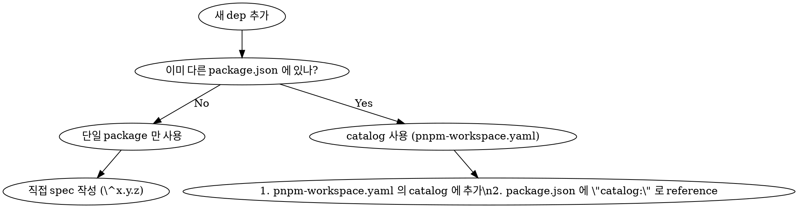

---
paths:
  - '**/package.json'
  - 'pnpm-workspace.yaml'
  - '.syncpackrc.json'
---

# Package Dependency Versioning

같은 외부 dep 가 monorepo 의 여러 package.json 에 spec 으로 분산되면 시간이 흐를수록 divergence — 다른 spec range, 다른 lockfile resolution, 디버깅 비용 ↑. 본 rule 은 SSoT 원칙의 dep 버전 layer 적용.

## 핵심 원칙

**같은 dep 이 2+ package.json 에 있으면 [pnpm catalog](https://pnpm.io/catalogs) 사용**. syncpack 룰 (`.syncpackrc.json` 의 "공유 dep 은 catalog: 강제" versionGroup) 이 declaration SSoT 까지 강제 — 같은 dep 이 2+ 곳에 있으면 모두 `catalog:` reference 여야 통과.

## 새 dep 추가 시 결정 트리



## 사용처

### 1. 신규 dep 추가

```bash
# 단일 package 사용 — 직접 추가
pnpm --filter <package> add <dep>

# 2+ package 공유 가능성 (확신 X) — catalog 가 안전한 default
# 1) pnpm-workspace.yaml 의 catalog 에 추가
# 2) .syncpackrc.json 의 "공유 dep" versionGroup 의 dependencies 배열에 추가
# 3) pnpm --filter <package> add <dep>@catalog:
```

### 2. 기존 dep 의 spec 변경

```bash
# catalog 에 있는 dep — pnpm-workspace.yaml 의 한 줄만 수정
# 그 외 — 모든 사용처 동시 수정 (syncpack 가 강제)
```

### 3. 검증

```bash
# 로컬 검증
pnpm package:check

# 자동 수정 (highest semver 로 정렬)
pnpm package:fix
```

CI 의 `ci-packages` job 이 모든 PR 에서 자동 검증.

## 자주 하는 실수

### 같은 dep 을 다른 spec 으로 추가

```jsonc
// ❌ Bad — drift 시작
// packages/foo/package.json
{ "dependencies": { "msw": "^2.13.6" } }

// packages/bar/package.json
{ "dependencies": { "msw": "^2.0.0" } }  // ← lockfile 자동 보정 되지만 미래 risk
```

```jsonc
// ✅ Good — catalog 로 SSoT
// pnpm-workspace.yaml
catalog:
  msw: ^2.13.6

// packages/foo, packages/bar 둘 다
{ "dependencies": { "msw": "catalog:" } }
```

### peerDependencies 와 dependencies 의 spec 불일치

peerDeps 는 일반적으로 loose range (`^x`), regular dep 는 specific. **다만 본 monorepo 는 self-contained** 라 peerDep 도 정확한 버전으로 핀 — `syncpack fix` 의 default 동작 따름.

## Tooling

- **[syncpack](https://jamiemason.github.io/syncpack/)** — version mismatch 검사 + auto-fix. CI + 로컬 모두.
- **[pnpm catalog](https://pnpm.io/catalogs)** — workspace 차원 dep 버전 SSoT. pnpm 9+.
