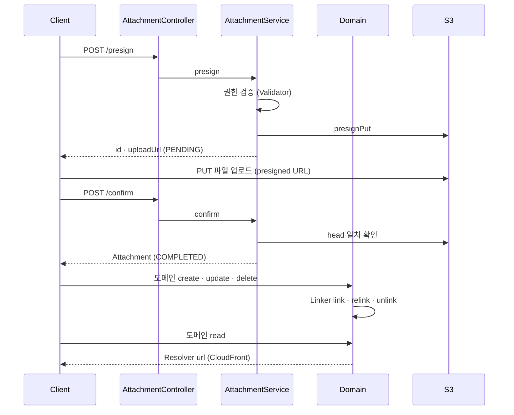
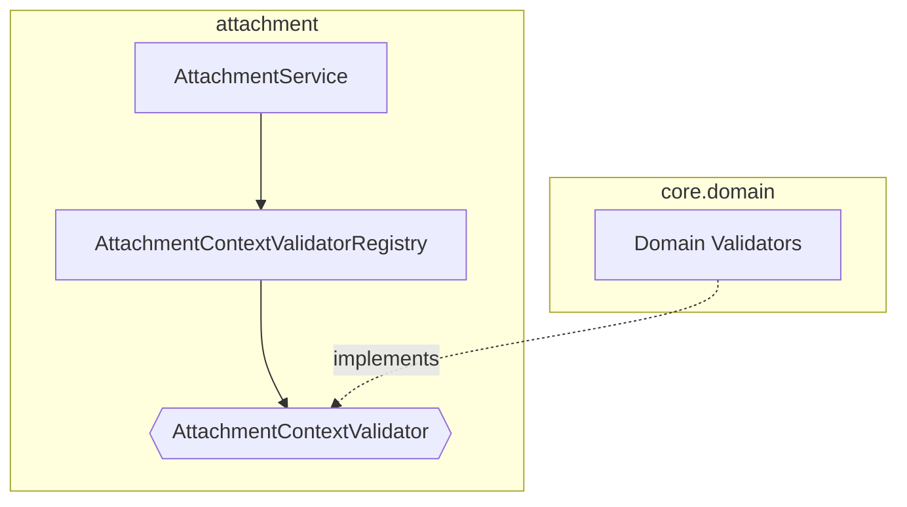
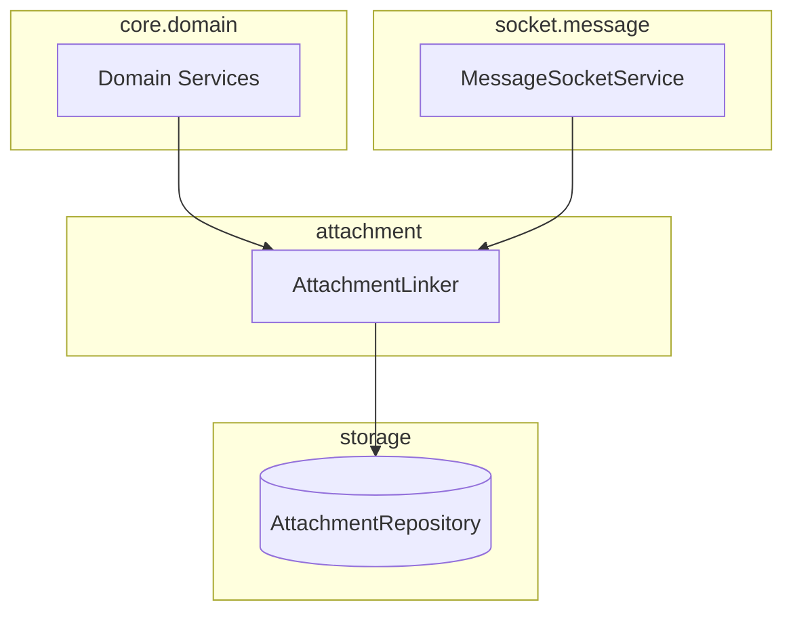
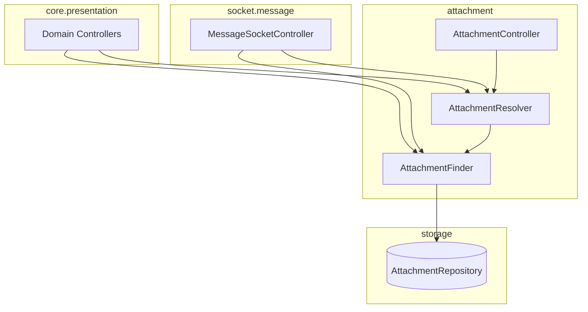
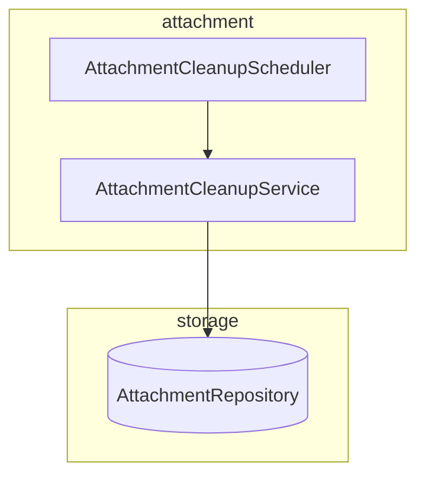

# attachment-architecture
- 위치 : `/attachment`, `/storage/attachment`, `/core/domain`
- 범위 : 첨부파일(Attachment)

## 생명주기

| 단계              | 처리                                                               | DB | S3          | 참조 |
|-----------------|------------------------------------------------------------------|----|-------------|----|
| presign         | 권한 검증 (AttachmentContextValidator) 및 KEY 생성 (AttachmentKeyUtils) | PENDING  | -  | -  |
| upload          | 클라이언트가 S3 파일 직접 업로드                                              | PENDING  | ○  | -  |
| confirm         | Attachment ↔ S3 head 일치 확인                                       | COMPLETED | ○  | -  |
| create          | Attachment 참조 추가 (AttachmentLinker)                              | COMPLETED | ○  | ○  |
| read            | CloudFront URL + Signed Cookie (AttachmentResolver)              | COMPLETED | ○  | ○  |
| update · delete | Attachment 참조 교체 · 삭제 (AttachmentLinker)                         | COMPLETED | ○  | - |
| cleanup         | Cleanup 규칙에 따라 S3 삭제  (AttachmentCleanupService)                 |  Soft Del | -  | -  |

## 컴포넌트 구성
- AttachmentKeyUtils : S3 object key · Signed Cookie scope 조립
- AttachmentFinder : Attachment 조회
- AttachmentResolver : CloudFront URL 조립 (조회는 Finder 위임)
- AttachmentLinker : 도메인 ↔ Attachment 참조 연결 · 해제
- AttachmentService : presign · confirm 처리
- AttachmentCleanupService : PENDING·고아 첨부 정리 (크론)
- S3FileStorage : S3 로직 처리
- SignedCookieIssuer : signed cookie 발급
- S3Presigner : AWS SDK presign (외부)
- S3Client : AWS SDK head·delete (외부)

### 권한 검증 (ContextValidator)

- AttachmentContextValidator : 컨텍스트별 presign 권한 검증 인터페이스
- Domain Validators : 도메인별 AttachmentContextValidator 구현체
- AttachmentContextValidatorRegistry : Validator 등록 · presign 권한 검증 위임

### 참조 관리 (Linker)

- Domain Services : 엔티티 생명주기에 따라 Attachment 참조 관리

### 조회 (Finder · Resolver)

- AttachmentFinder : Attachment 조회 (id · reference 기준)
- AttachmentResolver : CloudFront Url 조립 (getUrl · resolveUrlMap 은 Finder 위임)

### 삭제 (Cleanup)

- 매주 수요일 오전 6시 Pending, Orphan 엔티티 제거 (아래 표 참고)

Cleanup 규칙

| 대상 | 조건 | 의미                |
|---|---|-------------------|
| Pending | `status=PENDING` & `createdAt` 24h 경과 | presign 후 미confirm |
| Orphan | `status=COMPLETED` & `createdAt` 24h 경과 & `referenceId is null` | DB 삭제 후 S3 미삭제    |

### S3 키

키 생성 규칙

| 세그먼트 | context | contextId | type | size | uuid | ext |
|---|---|---|---|---|---|---|
| 의미 | 권한 scope | scope 식별자 | 파일 종류 | 이미지 사이즈 | 파일 식별자 | 확장자 |
| Enum | AttachmentContext | — | AttachmentType | ImageSize | — | — |
- `{context}/{contextId}/{type}/{size}/{uuid}.{ext}`
- size 세그먼트는 `IMAGE`에만 포함 (`FILE`은 생략)

Enum 구성

| Enum | 레이어    | 값 (path/ext)                                                                 | 의미                   |
|---|--------|------------------------------------------------------------------------------|----------------------|
| AttachmentContext | Storage | `CHAT`(chats), `COMPANY`(companies), `CREDENTIAL`(credentials), `DRIVE`(drives), `MEMBER`(members), `POST`(posts) | 권한 scope 종류 + path   |
| ReferenceType | Storage | `POST`, `MESSAGE`, `COMPANY`, `MEMBER`, `CREDENTIAL`, `DRIVE`                  | 엔티티 소유(참조)           |
| AttachmentType | Storage | `IMAGE`(images), `FILE`(files)                                               | 파일 종류 + path         |
| AttachmentStatus | Storage | `PENDING`, `COMPLETED`                                                       | 파일 업로드 상태            |
| ImageSize | Attachment | `ORIGINAL`(o), `MEDIUM`(m/webp), `SMALL`(s/webp)                             | 이미지 사이즈 + path + ext |
- Context : S3 저장 경로 · Signed Cookie 권한 범위를 나타냄
- Reference : DB 참조 · 도메인 소유를 나타냄
