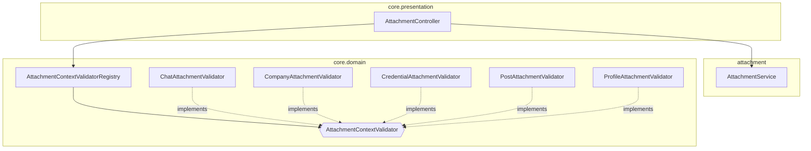
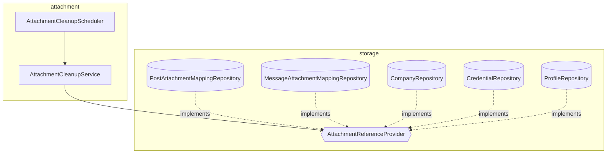

# attachment-architecture
- 위치 : `/attachment`, `/storage/attachment`, `/core/domain`
- 범위 : 첨부파일(Attachment)

## 컴포넌트
- AttachmentKeyUtils : S3 object key 생성
- AttachmentResolver : Attachment 읽기 경로 조립
- AttachmentQueryService : Attachment 조회 및 권한 검증
- AttachmentCleanupService : PENDING·고아 첨부 정리 (크론)
- S3FileStorage : presigned 로직 처리
- S3Presigner : AWS SDK presign (외부)
- S3Client : AWS SDK head·delete (외부)

## Key 생성 규칙

| 세그먼트 | context | contextId | type | size | uuid | ext |
|---|---|---|---|---|---|---|
| 의미 | 권한 scope | scope 식별자 | 파일 종류 | 이미지 사이즈 | 파일 식별자 | 확장자 |
| Enum | AttachmentContext | — | AttachmentType | ImageSize | — | — |
- `{context}/{contextId}/{type}/{size}/{uuid}.{ext}`

### Enum

| Enum | 레이어    | 값 (path/ext)                                                                 | 의미                  |
|---|--------|------------------------------------------------------------------------------|---------------------|
| AttachmentContext | Storage | `CHAT`(chats), `COMPANY`(companies), `CREDENTIAL`(credentials), `POST`(posts), `PROFILE`(profiles) | 권한 scope 종류 + path  |
| AttachmentType | Storage | `IMAGE`(images), `FILE`(files)                                               | 파일 종류 + path        |
| AttachmentStatus | Storage | `PENDING`, `COMPLETED`                                                       | 파일 업로드 상태           |
| ImageSize | Domain | `ORIGINAL`(o), `MEDIUM`(m/webp), `SMALL`(s/webp)                             | 이미지 사이즈 + path + ext |

## Validator · Cleanup 구조

### Validator 구조

- AttachmentContextValidator : Context별 presign 권한 검증 인터페이스
- AttachmentContextValidatorRegistry : Validator 등록 · 위임

### Cleanup 구조

- AttachmentReferenceProvider : 해당 컨텍스트의 연관된 엔티티 조회 → Orphan 판정

## Life cycle

| 단계              | 처리                                          | 상태        | DB       | S3          | 참조 |
|-----------------|---------------------------------------------|-----------|----------|-------------|----|
| presign         | 권한 검증 (ContextValidator) 후 presigned URL 발급 | PENDING   | ○        | -           | -  |
| upload          | 클라이언트가 presigned URL로 파일 업로드                | PENDING   | ○        | ○           | -  |
| confirm         | Attachment ↔ S3 head 일치 확인                  | COMPLETED | ○        | ○           | -  |
| create          | 각 도메인별 Validator 검증 + Attachment 참조 저장      | COMPLETED | ○        | ○           | ○  |
| read            | Resolver.url → CloudFront URL + Signe Cookie | COMPLETED | ○        | ○           | ○  |
| update · delete | Attachment 참조 교체 · 삭제                       | COMPLETED | ○        | ○           | ✕  |
| cleanup         | Cleanup 규칙에 따라 회수                           | -         | Soft Del | Hard Del | -  |

Cleanup 규칙

| 대상 | 조건 | 의미                |
|---|---|-------------------|
| Pending | `status=PENDING` & `createdAt` 24h 경과 | presign 후 미confirm |
| Orphan | context별 `status=COMPLETED` & `createdAt` 24h 경과 & ReferenceProvider 미참조 | DB 삭제 후 S3 미삭제    |
