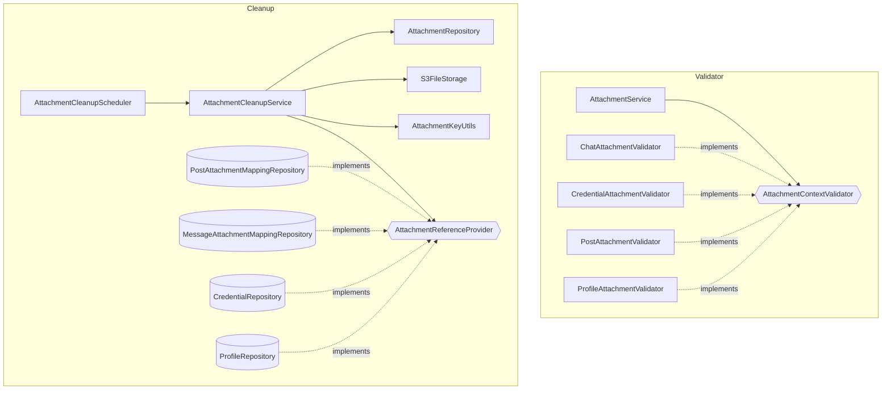

# attachment-architecture

## 범위
- 첨부파일(Attachment)
- 자격증명(Credential)

## 컴포넌트 목록
- AttachmentKeyUtils : S3 object key 생성
- AttachmentResolver : Attachment 읽기 경로 조립 (매핑 조회 resolveMap + CloudFront URL)
- AttachmentQueryService : Attachment 조회 및 권한 검증
- AttachmentContextValidator : Context별 presign 권한 검증 인터페이스
- AttachmentReferenceProvider : Context별 첨부 참조 여부 조회 인터페이스 (고아 판정)
- AttachmentCleanupService : PENDING·고아 첨부 정리 (크론)
- S3FileStorage : presigned 로직 처리
- S3Presigner : AWS SDK presigner (외부)
- S3Client : AWS SDK head·delete (외부)

## key 규칙
`{context}/{contextId}/{type}/{size}/{uuid}.{ext}`

| 세그먼트 | context | contextId | type | size | uuid | ext |
|---|---|---|---|---|---|---|
| 의미 | 권한 scope | scope 식별자 | 파일 종류 | 이미지 사이즈 | 파일 식별자 | 확장자 |
| Enum | AttachmentContext | — | AttachmentType | ImageSize | — | — |

## Enum

| Enum | 레이어    | 값 (path/ext)                                                                 | 의미                  |
|---|--------|------------------------------------------------------------------------------|---------------------|
| AttachmentContext | Storage | `CHAT`(chats), `CREDENTIAL`(credentials), `POST`(posts), `PROFILE`(profiles) | 권한 scope 종류 + path  |
| AttachmentType | Storage | `IMAGE`(images), `FILE`(files)                                               | 파일 종류 + path        |
| AttachmentStatus | Storage | `PENDING`, `COMPLETED`                                                       | 파일 업로드 상태           |
| ImageSize | Domain | `ORIGINAL`(o), `MEDIUM`(m/webp), `SMALL`(s/webp)                             | 이미지 사이즈 + path + ext |

## Validator · Cleanup 구조

- AttachmentReferenceProvider : 해당 컨텍스트의 연관된 엔티티 조회 → Orphan 판정
- AttachmentContextValidator : 해당 컨텍스트의 Presign 권한 검증

## 범위
- `/core/domain/attachment`
- `/storage/attachment`