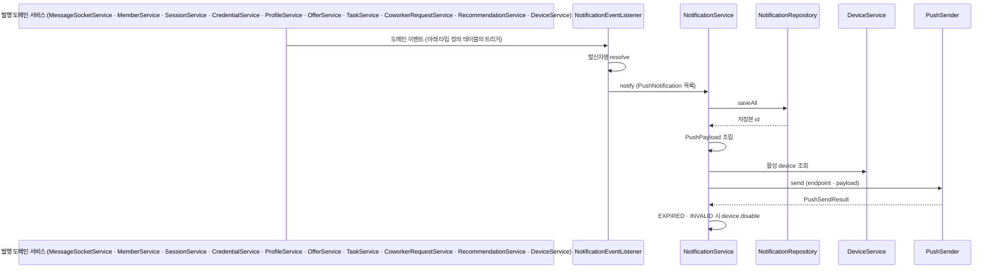
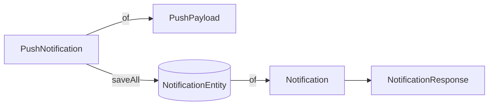

# notification-architecture
- 위치 : `/notification`, `/storage/notification`, `/storage/device`
- 범위 : 알림(Notification) 저장 · 조회 · 푸시(Push)

## 발송 흐름

| 단계 | 처리 | DB | Push |
|---|---|---|---|
| trigger | 도메인 상태 변경 커밋 후 이벤트 발행 (예: 채팅 저장 → `SocketMessageSentEvent`, 회원가입 → `MemberRegisteredEvent`) | 발행 도메인 테이블 | - |
| listen | `AFTER_COMMIT` 리스너가 이벤트별로 `PushNotification` 커맨드 조립 | - | - |
| save | 커맨드 → 엔티티 변환 후 `saveAll` | notifications | - |
| render | 저장본 id 와 커맨드로 `PushPayload` 조립. 미리보기 100자 절단 | - | - |
| send | 수신자의 모든 활성 device endpoint 로 동일 payload 발송 | device_tokens | ○ |
| disable | `EXPIRED` · `INVALID` endpoint 비활성화 | device_tokens | - |

- 채팅은 topic 미구독 참여자만 대상이다. 구독 중 회원은 실시간 수신 · 즉시 읽음 처리된다.
- 발신자명과 채팅 미리보기는 저장하지 않고 커맨드로만 전달한다.
- `notify` 는 `REQUIRES_NEW` 단일 진입점이며, device 단위 발송 실패는 try-catch 로 격리된다.

## 컴포넌트 구성
- NotificationEventListener : 도메인 이벤트 `AFTER_COMMIT` 구독 · 발신자명 resolve · `PushNotification` 조립
- NotificationService : 저장 · payload 조립 · 발송 · 무효 endpoint 비활성화
- NotificationQueryService : 목록 · unread count · 개별 · 전체 읽음 처리
- DeviceService : device token 등록 · 해제 · 활성 device 조회
- PushSender : push 발송 port. `send(endpoint, payload)` → `PushSendResult`
- PushEndpointRegistry : SNS endpoint 생성 · 복구 · 삭제 port
- SnsPushSender · SnsEndpointRegistry : AWS SNS 구현 (`prod | dev`)
- LoggingPushSender · LoggingEndpointRegistry : 로컬 · 테스트 구현 (`local | test`)

### 데이터 객체

| 객체 | 레이어 | 구성 | 용도 |
|---|---|---|---|
| PushNotification | Domain | memberId · type · senderType · senderId · senderName · referenceType · referenceId · body | 저장 · 발송 커맨드. id 없음 |
| PushPayload | Domain | id · title · body · referenceType · referenceId | 발송 페이로드. `of(id, command)` 로만 생성 |
| Notification | Domain | id · memberId · type · senderType · senderId · referenceType · referenceId · read · createdAt | 조회 도메인 |
| NotificationResponse | Presentation | senderType · senderMember · senderCompany · message · reference* | 목록 응답 |

- 커맨드와 페이로드 분리로 저장 전 객체가 발송에 넘어가는 경로를 타입으로 차단한다.
- 문구 조립은 `NotificationType.render(senderName)` 이 단독 소유한다.
- 목록 응답의 발신자 이미지는 `AttachmentUrlService` 로 `MEMBER` · `COMPANY` referenceType 별 조회해 senderMember · senderCompany 의 picture 에 주입하고, 두 scope 의 signed cookie 를 함께 발급한다.

## 타입 정의

| type | senderType | referenceType | 템플릿 | 트리거 |
|---|---|---|---|---|
| CHAT_MESSAGE | MEMBER | CHAT_ROOM | `%s님이 메시지를 보냈습니다` | ✅ SocketMessageSentEvent |
| SIGNUP_WELCOME | — | — | `회원가입을 축하드립니다` | ✅ MemberRegisteredEvent, 항상 |
| PROFILE_COMPLETION | — | PROFILE | `프로필을 완성하고 업체로부터 일감을 받아보세요` | ✅ MemberRegisteredEvent, 프로필 미완성 시 |
| PROFILE_COMPLETED | — | PROFILE | `프로필이 완성되었습니다` | ✅ ProfileCreatedEvent |
| NEW_DEVICE_LOGIN | — | — | `새로운 기기에서 로그인되었습니다` | ✅ NewDeviceLoginEvent |
| DEVICE_REGISTERED | — | — | `알림 수신 설정이 완료되었습니다` | ✅ DeviceRegisteredEvent, 신규 토큰 등록 시 (refresh 제외) |
| CREDENTIAL_ACCEPTED | — | CREDENTIAL | `자격 증명이 승인되었습니다` | ✅ CredentialReviewedEvent |
| CREDENTIAL_DENIED | — | CREDENTIAL | `자격 증명이 반려되었습니다` | ✅ CredentialReviewedEvent |
| COWORKER_REQUESTED | MEMBER | COWORKER_REQUEST | `%s 님으로부터 동료 요청을 제안받았습니다` | ✅ CoworkerRequestedEvent |
| COWORKER_ACCEPTED | MEMBER | — | `%s 님이 동료 요청을 수락했습니다` | ✅ CoworkerAcceptedEvent (요청·거절·취소는 무음) |
| OFFER_RECEIVED | COMPANY | OFFER | `%s으로부터 섭외 요청을 제안받았습니다` | ✅ OfferEvent ACTIVE → 기술자 |
| OFFER_SENT | MEMBER | OFFER | `%s님에게 섭외 요청이 전달되었습니다` | ✅ OfferEvent ACTIVE → 업체 대표 |
| OFFER_ACCEPTED | MEMBER | OFFER | `%s님이 섭외 요청을 수락했습니다` | ✅ OfferEvent ACCEPTED → 업체 대표 |
| OFFER_ACCEPT_COMPLETED | COMPANY | OFFER | `%s의 섭외 요청을 수락했습니다` | ✅ OfferEvent ACCEPTED → 기술자 |
| OFFER_DENIED | MEMBER | OFFER | `%s님이 섭외 요청을 거절했습니다` | ✅ OfferEvent DENIED → 업체 대표 (PENDING·EXPIRED·CANCELED 는 무음) |
| RECOMMENDATION_WRITTEN | MEMBER | RECOMMENDATION | `%s 님으로부터 추천서를 작성받았습니다` | ✅ RecommendationWrittenEvent |
| CONTRACT_WRITTEN | MEMBER | CONTRACT | `%s 님으로부터 계약서를 작성받았습니다` | ⬜ 미배선 |
| TASK_COMPLETED | — | 미정 | `작업이 완료되었습니다` | ⬜ 타입만 정의 (작업 완료 기능 미구현) |
| TASK_UPDATED | COMPANY | TASK | `작업 내용이 변경되었습니다` | ✅ TaskEvent → 기술자 (업체가 공종 · 일정 · 요구사항 변경 시) |
| DRIVE_SHARED | MEMBER | 미정 | `%s 님이 드라이브를 공유했습니다` | ⬜ 타입만 정의 (드라이브 공유 기능 미구현) |
| DRIVE_NOTE_CREATED | MEMBER | 미정 | `%s 님이 노트를 작성했습니다` | ⬜ 타입만 정의 (드라이브 공유 기능 미구현) |

- 이동 정보는 `referenceType` 과 `referenceId` 로만 표현한다. BE 는 딥링크 URL 을 조립하지 않는다.
- 발신자명은 저장하지 않고 `senderType` 기준으로 resolve 한다.
- PROFILE_COMPLETION 은 가입 시 미완성 프로필 **유도**, PROFILE_COMPLETED 는 프로필 생성 시점 **완성 확인** 용도로 구분된다.
- DEVICE_REGISTERED 는 수신자의 모든 활성 device 로 발송된다 (신규 device 한정 발송은 `notify` 인프라 확장이 필요해 수용하지 않음).
- NewDeviceLoginEvent 는 SMS(SmsEventListener)와 푸시(NotificationEventListener)가 함께 구독한다.

## Push Payload (FCM v1)
`MessageStructure=json` 으로 최상위 `default` · `GCM` 키를 발송한다. `GCM` 값은 FCM v1 `fcmV1Message` 래퍼다.

| 위치 | 필드 | 값 |
|---|---|---|
| notification | title | `PushPayload.title` |
| notification | body | `PushPayload.body`, 최대 100자 |
| data | notification_id | 저장된 알림 id |
| data | reference_type | `NotificationReferenceType` 소문자, 없으면 `""` |
| data | reference_id | reference_id, 없으면 `""` |
| webpush | notification.icon · badge | 앱 아이콘 |
| webpush | fcm_options.link | fallback 진입 URL |

- FCM v1 `data` 값은 모두 string 이어야 한다.

## SNS 에러 핸들링

| SNS 에러 | 결과 | 처리 |
|---|---|---|
| `EndpointDisabled` | EXPIRED | `device.disable()` |
| `NotFound` | EXPIRED | `device.disable()` |
| `InvalidParameter`, endpoint · targetarn 관련 | INVALID | `device.disable()` |
| `InvalidParameter`, 그 외 · 나머지 전부 | FAILED | 비활성화 없음 |

- delivery 실패는 비동기라 첫 실패는 SUCCESS 로 보이고, 다음 publish 에서 `EndpointDisabled` 로 잡힌다.

## 알림 타입 확장
1. `NotificationType` 에 상수 · 템플릿 추가
2. 필요 시 `NotificationReferenceType` 에 이동 화면 추가
3. 발행 패키지에 이벤트 record 정의 · 발행
4. `NotificationEventListener` 에 `@TransactionalEventListener(AFTER_COMMIT)` 메서드 추가 · `notify` 호출
5. 시스템 알림은 `senderType` · `senderId` · `senderName` · `referenceType` = null

## 래퍼런스
- [Spring Framework : Transaction-bound Events](https://docs.spring.io/spring-framework/reference/data-access/transaction/event.html)
- [AWS SNS : Mobile push (FCM HTTP v1)](https://docs.aws.amazon.com/sns/latest/dg/sns-mobile-application-as-subscriber.html)
- [AWS SNS : Publish API (MessageStructure=json)](https://docs.aws.amazon.com/sns/latest/api/API_Publish.html)
- [AWS SNS : FCM endpoint management](https://docs.aws.amazon.com/sns/latest/dg/sns-fcm-endpoint-management.html)
