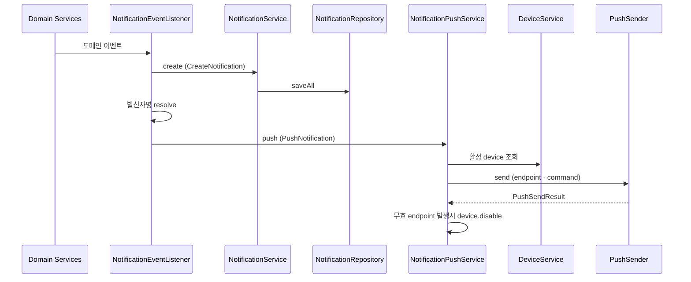
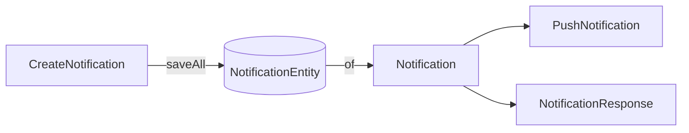

# notification-architecture
- 위치 : `/notification`, `/storage/notification`, `/storage/device`
- 범위 : 알림(Notification) 저장 · 조회 · 푸시(Push)

## 발송 흐름

| 단계 | 처리                                           | DB 테이블       | Push |
|---|----------------------------------------------|--------------|---|
| trigger | 도메인 상태 변경 커밋 후 이벤트 발행                        | 발행 도메인 테이블   | - |
| listen | `AFTER_COMMIT` 리스너가 이벤트별로 영속화 · 알림 발송 커맨드 조립 | -            | - |
| save | 커맨드 → 엔티티 변환 후 `saveAll`. 도메인 객체 반환          | notifications | - |
| send | 수신자의 모든 활성 디바이스 endpoint 로 알림 발송             | device_tokens | ○ |
| disable | 디바이스 예외 처리 · endpoint 비활성화                   | device_tokens | - |

- 채팅은 topic 미구독 참여자만 대상이며 `MessageSocketService` 가 `push` 를 직접 호출한다. 영속화하지 않는다.
- 발신자명과 알림 내용 미리보기는 저장하지 않고 커맨드로만 전달한다.
- `create` · `push` 는 각각 `REQUIRES_NEW` 진입점이며, device 단위 발송 실패는 try-catch 로 격리된다.

## 컴포넌트 구성
- NotificationEventListener : 도메인 이벤트 구독 · 오케스트레이션
- NotificationService : 알림 영속화
- NotificationPushService : 디바이스 조회 · 알림 발송
- NotificationQueryService : 조회 · 읽음 처리
- DeviceService : 디바이스 등록 · 해제, 활성 디바이스 조회
- PushSender : Push 발송 인터페이스
- PushEndpointRegistry : SNS endpoint 생성 · 복구 · 삭제 인터페이스
- SnsPushSender · SnsEndpointRegistry : AWS SNS 구현 (`prod | dev`)
- LoggingPushSender · LoggingEndpointRegistry : 로컬 · 테스트 구현 (`local | test`)

### 데이터 객체

| 객체 | 레이어 | 구성 | 용도 |
|---|---|---|---|
| CreateNotification | Domain | memberId · type · senderType · senderId · referenceType · referenceId | 영속화 커맨드. id 없음 |
| PushNotification | Domain.push | id · receiverId · title · body · referenceType · referenceId | 발송 커맨드. 조립 생성자가 제목 렌더링 · 본문 절단 수행 |
| Notification | Domain | id · memberId · type · senderType · senderId · referenceType · referenceId · read · createdAt | 조회 도메인 |
| NotificationResponse | Presentation | senderType · senderMember · senderCompany · message · reference* | 목록 응답 |

- 커맨드 분리로 저장 전 객체가 발송에 넘어가는 경로를 타입으로 차단한다.
- 미저장 발송은 `id` 가 `null` 인 `PushNotification` 을 직접 조립해 `push` 로 전달한다.
- 문구 조립은 `NotificationType.render(senderName)` 이 단독 소유하며 `PushNotification` 생성자에서만 호출한다.

## 알림 유형

| type | senderType | referenceType | 트리거 이벤트 | 메시지 | 알림 | 영속화 |
|---|---|---|---|---|---|---|
| SIGNUP_WELCOME | — | — | MemberRegisteredEvent | ✕ | ○ | ○ |
| PROFILE_COMPLETED | — | PROFILE | ProfileCreatedEvent | ✕ | ○ | ○ |
| NEW_DEVICE_LOGIN | — | — | NewDeviceLoginEvent | ✕ | ○ | ○ |
| DEVICE_REGISTERED | — | — | DeviceRegisteredEvent | ✕ | ○ | ○ |
| CREDENTIAL_ACCEPTED | — | CREDENTIAL | CredentialReviewedEvent | ✕ | ○ | ○ |
| CREDENTIAL_DENIED | — | CREDENTIAL | CredentialReviewedEvent | ✕ | ○ | ○ |
| COWORKER_REQUESTED | MEMBER | COWORKER_REQUEST | CoworkerRequestedEvent | ✕ | ○ | ○ |
| COWORKER_ACCEPTED | MEMBER | — | CoworkerAcceptedEvent | ✕ | ○ | ○ |
| OFFER_RECEIVED | COMPANY | CHAT_ROOM | OfferEvent | ○ | ○ | ○ |
| OFFER_SENT | MEMBER | CHAT_ROOM | OfferEvent | ○ | ○ | ○ |
| OFFER_ACCEPTED | MEMBER | CHAT_ROOM | OfferEvent | ○ | ○ | ○ |
| OFFER_ACCEPT_COMPLETED | COMPANY | CHAT_ROOM | OfferEvent | ○ | ○ | ○ |
| OFFER_DENIED | MEMBER | CHAT_ROOM | OfferEvent | ✕ | ○ | ○ |
| RECOMMENDATION_WRITTEN | MEMBER | RECOMMENDATION | RecommendationWrittenEvent | ✕ | ○ | ○ |
| TASK_UPDATED | COMPANY | TASK | TaskEvent | ○ | ○ | ○ |
| CONTRACT_WRITTEN | MEMBER | CONTRACT | — | — | — | — |
| TASK_COMPLETED | — | 미정 | — | — | — | — |
| DRIVE_SHARED | MEMBER | 미정 | — | — | — | — |
| DRIVE_NOTE_CREATED | MEMBER | 미정 | — | — | — | — |

- 이동 정보는 `referenceType` 과 `referenceId` 로만 표현한다. BE 는 딥링크 URL 을 조립하지 않는다.
- 섭외 알림은 업체 대표와 기술자의 DirectChat 으로 이동한다.
- 발신자명은 저장하지 않고 `senderType` 기준으로 resolve 한다.
- DEVICE_REGISTERED 는 수신자의 모든 활성 device 로 발송된다.
- 신규 device 한정 발송은 `push` 인프라 확장이 필요해 수용하지 않는다.
- 이벤트는 여러 EventListener에서 함께 구독할 수 있다.

### 채팅 메시지
- 채팅 메시지는 이벤트 없이 `MessageSocketService` 가 `push` 를 직접 호출한다.
- 채팅 메시지에 대한 알림 미리보기는 `SendMessage.preview` 가 결정한다.

## Push Payload (FCM v1)
| 위치 | 필드 | 값                               | 비고            |
|---|---|---------------------------------|---------------|
| notification | title | `PushNotification.title`        |               |
| notification | body | `PushNotification.body`         | 최대 100자       |
| data | notification_id | 저장된 알림 id                       | 미저장시 `"null"` |
| data | reference_type | `NotificationReferenceType` 소문자 | 없으면 `""`      |
| data | reference_id | reference_id | 없으면 `""`      |

- `MessageStructure=json` 으로 최상위 `default` · `GCM` 키를 발송한다
- `GCM` 값은 FCM v1 `fcmV1Message` 래퍼다.
- FCM v1 `data` 값은 모두 string 이어야 한다.

## SNS 에러 핸들링

| SNS 에러                                | 결과 | 디바이스 처리 |
|---------------------------------------|---|--------|
| `EndpointDisabled`                    | EXPIRED | 비활성화   |
| `NotFound`                            | EXPIRED | 비활성화   |
| `InvalidParameter`, endpoint · arn 관련 | INVALID | 비활성화   |
| `InvalidParameter`, 그 외 · 나머지 전부      | FAILED | -      |

- delivery 실패는 비동기라 첫 실패는 SUCCESS 로 보이고, 다음 publish 에서 `EndpointDisabled` 로 잡힌다.

## 알림 타입 확장
1. `NotificationType` 에 상수 · 템플릿 추가
2. 필요 시 `NotificationReferenceType` 에 이동 화면 추가
3. 발행 패키지에 이벤트 record 정의 · 발행
4. `NotificationEventListener`에 핸들링 메서드 추가

## 래퍼런스
- [Spring Framework : Transaction-bound Events](https://docs.spring.io/spring-framework/reference/data-access/transaction/event.html)
- [AWS SNS : Mobile push (FCM HTTP v1)](https://docs.aws.amazon.com/sns/latest/dg/sns-mobile-application-as-subscriber.html)
- [AWS SNS : Publish API (MessageStructure=json)](https://docs.aws.amazon.com/sns/latest/api/API_Publish.html)
- [AWS SNS : FCM endpoint management](https://docs.aws.amazon.com/sns/latest/dg/sns-fcm-endpoint-management.html)
