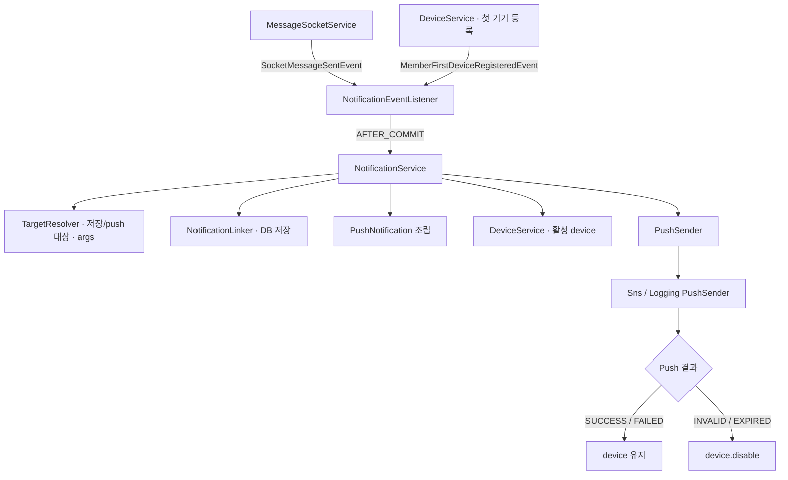
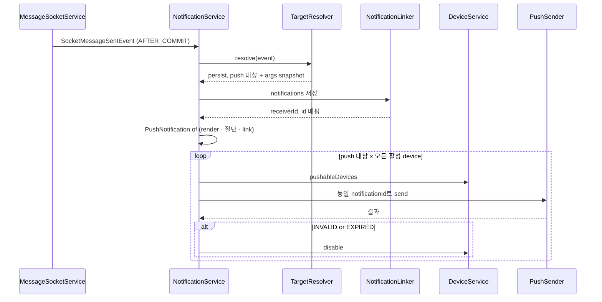
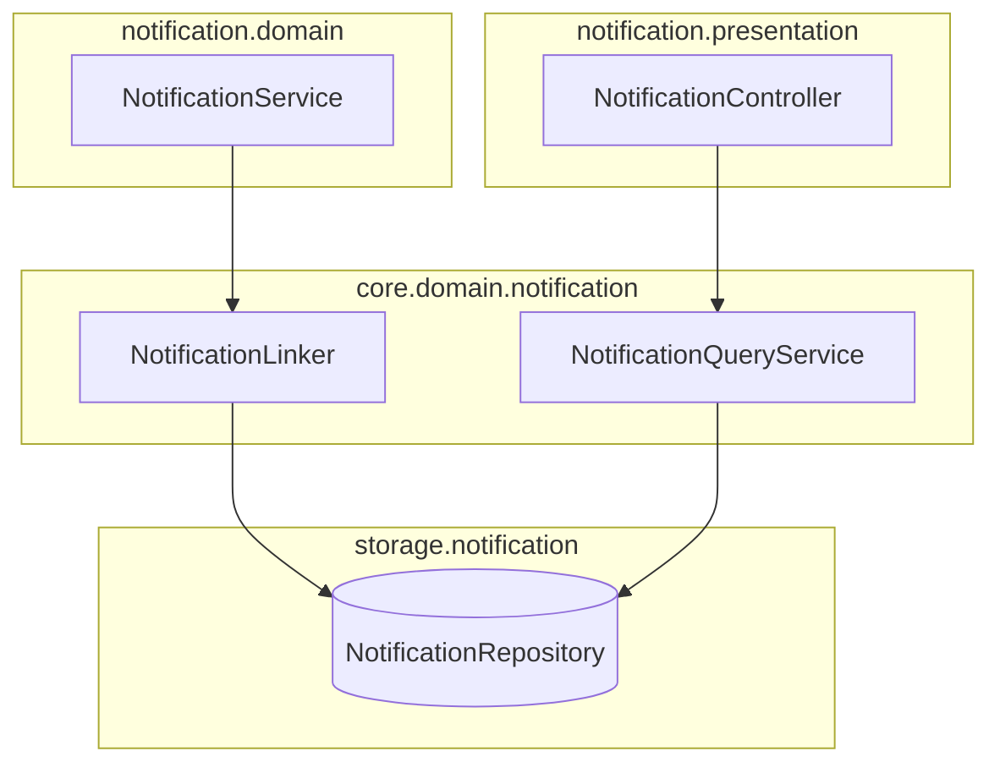
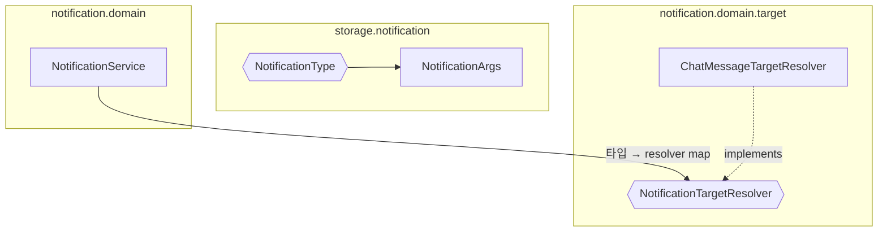

# notification-architecture
- 위치 : `/notification`, `/core/domain/notification`, `/storage/notification`, `/storage/device`, `/socket/message`
- 범위 : 알림(Notification) 저장 · 조회 · 푸시(Push)

## 처리 흐름



| 단계 | 처리 | DB | Push |
|---|---|---|---|
| trigger | 채팅 메시지 저장 후 `SocketMessageSentEvent` 발행 (socket — 참여자를 topic 구독 중(`activeIds`) / 미구독(`inactiveIds`) 으로 분리해 담음) | messages | - |
| listen | `AFTER_COMMIT` 이후 리스너가 `NotificationService.handle` 위임 | - | - |
| resolve | 채팅은 topic 미구독(`inactiveIds`) 참여자만 저장·push 대상으로 지정, 이벤트 시점 렌더 변수(`senderName`) snapshot 도 resolver 가 생성 (발신자 탈퇴 시 `getOrWithdrawn` placeholder) | - | - |
| link | 수신자별 알림 저장 (`sender_name` · `company_name` = args snapshot) | notifications | - |
| render | 타입 enum 이 `title` 렌더 · `link` 조립 | - | - |
| send | 대상별 모든 활성 device endpoint 로 동일한 알림 id의 push 발송 | device_tokens | ○ |
| disable | `INVALID` / `EXPIRED` endpoint 비활성화 | device_tokens | - |

- 온보딩 알림은 **회원의 첫 기기 등록**(`MemberFirstDeviceRegisteredEvent`, 회원당 1회)이 trigger다. 이후 resolve~disable 단계는 채팅과 동일하며 **본인에게** 저장·발송한다 — 가입 축하(`SIGNUP_WELCOME`)는 항상, 프로필 완성 제안(`PROFILE_COMPLETION`)은 프로필 미완성 시에만.
- 채팅의 WebSocket topic 구독 여부가 알림 대상을 가른다 — 구독 중(`activeIds`) 회원은 메시지를 실시간 수신하고 읽음 위치가 즉시 갱신되므로 알림 저장·push 대상에서 제외되고, 미구독(`inactiveIds`) 참여자만 대상이 된다. 발신자는 자신의 topic 을 구독 중이므로 자연히 제외된다.

## 시퀀스



## 컴포넌트 구성
- NotificationEventListener : 도메인 이벤트(`SocketMessageSentEvent` · `MemberFirstDeviceRegisteredEvent`)를 `AFTER_COMMIT` 구독 후 위임 — 첫 기기 등록 이벤트 하나가 `SIGNUP_WELCOME` · `PROFILE_COMPLETION` 두 타입을 트리거
- NotificationService : 알림 처리 흐름 조립 (대상 분리 → 저장 → 렌더 → 발송 → 무효 토큰 비활성화) — 생성자에서 타입 → resolver map 구성 (미등록 시 `UNKNOWN_TYPE`)
- NotificationTargetResolver : 타입별 저장 대상 · push 대상 · 렌더 변수(`NotificationArgs`) snapshot 계산 (전략, `notification.domain.target`) — 구현체 : `ChatMessageTargetResolver` · `SignupWelcomeTargetResolver` · `ProfileCompletionTargetResolver`
- PushNotification : push 메시지 조립 (`of` — title 렌더 · 본문 100자 절단 · link) · payload 변환
- NotificationLinker : 알림 DB 저장 전담 (`core.domain.notification`)
- NotificationQueryService : 알림 조회 · unread · 읽음 처리 전담 (`core.domain.notification`)
- DeviceService : device token 등록 · 해제 · push 가능 device 조회 — 회원의 **첫 기기 등록 시 `MemberFirstDeviceRegisteredEvent` 발행**(온보딩 트리거)
- PushSender / PushEndpointRegistry : push 발송 · SNS endpoint 관리 port (`notification.domain.push`)
- SnsPushSender / SnsEndpointRegistry : AWS SNS 구현 (`dev | prod`)
- LoggingPushSender / LoggingEndpointRegistry : 로컬 · 테스트 구현 (`local | test`)

## 패키지 · 의존성
```text
to.bconnect.api
├── notification                              # 알림 이벤트 구독 · 대상 계산 · 저장 조립 · push 발송
│   ├── domain                                # 외부 구현체를 모르는 port · 이벤트 · orchestration
│   │   ├── DeviceService.java                # token upsert/해제/조회 · 첫 기기 등록 이벤트 발행
│   │   ├── MemberFirstDeviceRegisteredEvent.java # 첫 push device 등록 사건. 온보딩 알림 트리거
│   │   ├── NotificationEventListener.java    # 채팅/첫 기기 이벤트를 AFTER_COMMIT 구독해 service 위임
│   │   ├── NotificationService.java          # 타입 → resolver 선택 · 대상 계산 → 저장 → 발송 → 무효 endpoint 비활성화
│   │   ├── push                              # push 발송 port · 공통 payload/result 모델
│   │   │   ├── PushEndpointRegistry.java     # endpoint 생성/복구/삭제 port
│   │   │   ├── PushNotification.java         # title 렌더 · body 100자 절단 · link 조립, payload 변환
│   │   │   ├── PushPayload.java              # title/body/link/data 전송 중립 모델
│   │   │   ├── PushSendResult.java           # SUCCESS/FAILED/EXPIRED/INVALID 결과
│   │   │   └── PushSender.java               # endpoint 단위 push 발송 port
│   │   └── target                            # 타입별 저장/push 대상 계산 전략
│   │       ├── NotificationTargetResolver.java          # 타입별 resolver 인터페이스
│   │       ├── ChatMessageTargetResolver.java           # topic 미구독(inactive) 참여자를 저장 · push 대상으로 지정 · senderName args 생성
│   │       ├── SignupWelcomeTargetResolver.java         # 첫 기기 등록 회원 본인에게 항상 알림
│   │       ├── ProfileCompletionTargetResolver.java     # 프로필 미완성 회원 본인에게만 알림
│   │       └── ResolvedNotification.java                # sender/reference/content/args + persist/push 대상
│   ├── infrastructure                         # 외부 시스템 adapter
│   │   └── push
│   │       ├── SnsConfig.java                 # dev/prod용 AWS SNS client bean
│   │       ├── SnsProperties.java             # app.sns 설정 바인딩
│   │       ├── SnsPushSender.java             # SNS FCM v1 발송 · AWS 예외를 공통 결과로 변환
│   │       ├── SnsEndpointRegistry.java       # SNS endpoint 생성/복구/활성화/삭제
│   │       ├── LoggingPushSender.java         # local/test용 무발송 sender
│   │       └── LoggingEndpointRegistry.java   # local/test용 가짜 endpoint registry
│   └── presentation
│       └── v1
│           ├── DeviceController.java          # POST/DELETE /api/v1/devices
│           ├── NotificationController.java    # 목록 · unread 조회(GET) / 단건 · 전체 읽음 처리(POST) API
│           ├── request
│           │   ├── RegisterDeviceRequest.java
│           │   └── UnregisterDeviceRequest.java
│           └── response
│               ├── NotificationResponse.java  # enum 기반 문구/referenceType + sender/read 상태 조립
│               └── RegisterDeviceResponse.java
├── socket
│   └── message
│       ├── MessageSocketController.java        # STOMP 메시지 수신 endpoint (group/direct)
│       ├── MessageSocketService.java           # 메시지 저장 · 구독(active) 회원 읽음 갱신 · active/inactive 분리 이벤트 발행
│       ├── SendMessageRequest.java             # STOMP 발신 요청 payload
│       └── SocketMessageSentEvent.java         # notification이 구독하는 채팅 발생 이벤트 (active/inactive/preview)
├── core
│   └── domain
│       └── notification                       # 알림 영속화 · 조회 core 로직
│           ├── Notification.java              # entity를 변환한 조회용 불변 모델
│           ├── NotificationEvent.java         # 알림 트리거 이벤트 마커 인터페이스
│           ├── NotificationLinkCommand.java   # 알림 저장 command
│           ├── NotificationLinker.java        # 수신자별 저장 · receiverId→notificationId 반환
│           ├── NotificationQueryService.java  # 목록/unread/개별·전체 읽음 처리
│           └── NotificationExceptionCode.java # NOT_FOUND/FORBIDDEN/UNKNOWN_TYPE
└── storage
    ├── device                                 # device_tokens 영속화
    │   ├── DevicePlatform.java                # web/android/ios
    │   ├── DeviceTokenEntity.java             # token/endpoint/enabled (해제 시 row 물리 삭제)
    │   └── DeviceTokenRepository.java         # token/회원/활성 device 조회 · 첫 기기 존재 확인
    └── notification                           # notifications 영속화
        ├── NotificationArgs.java              # 렌더 변수 snapshot (@Embeddable record)
        ├── NotificationEntity.java            # type_code/reference_id/args(@Embedded)/read_at 저장
        ├── NotificationReferenceType.java     # 프론트 이동 화면 enum(DB 컬럼 아님)
        ├── NotificationType.java              # 6종 타입의 type_code/reference_type/문구/link 규칙
        └── NotificationRepository.java        # 커서 목록/unread/전체 읽음 쿼리
```
- `notification` 은 sink 모듈이다. 다른 패키지는 `notification` 을 의존하지 않는다.
- 의존 방향 : `notification → socket · core · storage · security · attachment · common`
- port/adapter : `notification.infrastructure.push → notification.domain.push` (역방향 금지 — domain 하위(push·target)는 infrastructure 를 모른다)
- 저장 · 조회는 `core.domain.notification` 소유 : `notification.domain → core.domain.notification`
- socket 은 `SocketMessageSentEvent` 만 발행하고 알림을 모른다 (이벤트 역전).
- 규칙은 `PackageDependencyTest`(sink·`notificationDomainIsPortSide`) · `LayerDependencyTest` 로 강제한다.

### 저장 · 조회 (Linker / QueryService)


- NotificationLinker : 수신자별 알림 저장, `receiverId → notificationId` 반환 (`link`)
- NotificationQueryService : 목록 조회 · unread count · 읽음 · 전체 읽음

## 타입 정의 (enum 중심)
- 알림 타입 · 메시지 템플릿 · 이동 링크 · reference_type 은 DB 가 아니라 `NotificationType` enum 이 소유한다.
- 타입별 동작은 enum 상수의 추상 메서드로 개별화한다.



| 요소 | 레이어 | 값 · 키 | 개별화 | 의미 |
|---|---|---|---|---|
| NotificationType | storage.notification | 아래 카탈로그 | `template` + `formatArgs(args)` → `render` · `referenceType()` · `link()` | 타입별 문구(format string) · 링크 정의. entity 가 `@Enumerated(STRING)` 으로 저장 |
| NotificationReferenceType | storage.notification | `NONE` · `CHAT_ROOM` · `PROFILE` · `COWORKER_REQUEST` · `OFFER` · `CONTRACT` | — | 프론트 이동 화면 의미 (라우팅). `NONE` = 이동 없음(link null) |
| NotificationArgs | storage.notification | `senderName` · `companyName` (`@Embeddable` record) | `render` 변수 snapshot | 이벤트 시점 렌더 변수. 개별 컬럼으로 저장 |
| NotificationEvent | core.domain.notification | — (마커 인터페이스) | 트리거 이벤트 공통 타입 | `SocketMessageSentEvent` · `MemberFirstDeviceRegisteredEvent` 가 구현 |
| NotificationTargetResolver | notification.domain.target | `supports()` · `resolve(event)` → `ResolvedNotification` (sender/reference/content/args + `Targets`) | 타입별 대상 · args 계산 (`E extends NotificationEvent`) | 저장 · push 대상 분리 + 렌더 변수 snapshot |

알림 타입 카탈로그

| type_code | reference_type | 문구 (template) | 변수 | 트리거 |
|---|---|---|---|---|
| CHAT_MESSAGE | CHAT_ROOM | `%s님이 메시지를 보냈습니다` | senderName | ✅ SocketMessageSentEvent |
| SIGNUP_WELCOME | NONE | `회원가입을 축하드립니다` | — | ✅ MemberFirstDeviceRegisteredEvent (본인, 항상) |
| PROFILE_COMPLETION | PROFILE | `프로필을 완성하고 업체로부터 일감을 받아보세요` | — | ✅ MemberFirstDeviceRegisteredEvent (본인, 프로필 미완성 시) |
| COWORKER_REQUESTED | COWORKER_REQUEST | `%s 님으로부터 동료 요청을 제안받았습니다` | senderName | ⬜ 미배선 |
| OFFER_RECEIVED | OFFER | `%s으로부터 섭외 요청을 제안받았습니다` | companyName | ⬜ 미배선 |
| CONTRACT_WRITTEN | CONTRACT | `%s 님으로부터 계약서를 작성받았습니다` | senderName | ⬜ 미배선 |

- 문구는 format string(`%s`)이며 `template.formatted(formatArgs(args))` 로 렌더한다 — placeholder 는 필요한 만큼 확장 가능하다.
- 트리거 ⬜ 는 문구 · 이동만 정의된 상태이며, 발행 이벤트 · 수신자(resolver) 배선은 후속 작업이다.
- render 변수는 이벤트 시점에 snapshot(`NotificationArgs`) 으로 만들어 `sender_name` · `company_name` 컬럼에 저장한다 (`@Embedded`).
- 목록 조회 렌더는 저장된 snapshot 을 사용하고, snapshot 이 비어있을 때만 현재 sender 이름으로 대체한다.
- push 렌더도 같은 snapshot 을 사용하므로, DB 히스토리와 push 문구가 일치한다.

## 데이터
`notifications`

| 컬럼 | 타입 | 의미 |
|---|---|---|
| sender_id | bigint (nullable) | 발신자 (시스템 알림은 null) |
| receiver_id | bigint | 수신자 |
| type_code | varchar | `NotificationType.name()` |
| reference_id | bigint (nullable) | 이동 대상 식별자 (없으면 null) |
| content | text (nullable) | 본문 (예: 메시지 미리보기) |
| sender_name | varchar (nullable) | 렌더 변수 snapshot (발신자명) |
| company_name | varchar (nullable) | 렌더 변수 snapshot (업체명) |
| read_at | timestamp (nullable) | 읽은 시각. `null` 이면 안읽음 |

- 이동 정보는 `reference_type`(enum) + `reference_id` 로만 표현한다. `link` 컬럼은 두지 않는다.
- 읽음 여부는 `is_read` 컬럼 없이 `read_at is not null` 로 판단한다.
- `reference_type` · 메시지는 저장하지 않는다 (enum 소유).

`device_tokens`

| 컬럼 | 타입 | 의미 |
|---|---|---|
| member_id | bigint | 소유 회원 |
| token | varchar (unique) | FCM 토큰 |
| platform | varchar | `web` · `android` · `ios` |
| sns_endpoint_arn | varchar | SNS platform endpoint |
| enabled | boolean | 유효 여부 (`INVALID`/`EXPIRED` 시 false) |

## Push Payload
- push 는 DB 구조(reference_type + reference_id)로 조립한 `link` 를 전송한다.
- 수신자별 알림은 DB에 1건 저장하며, 그 수신자의 모든 활성 device endpoint에는 같은 `notification_id`를 전송한다.

| 필드 | 값 | 용도 |
|---|---|---|
| title | `NotificationType.render(args)` | 표시 제목 |
| body | `content` 미리보기 (최대 100자) | 표시 본문 |
| link | `/n/{reference_type}/{reference_id}` | 이동 링크 |
| data.notification_id | 저장된 알림 id | 읽음 처리 |
| data.type_code | `NotificationType.name()` | 타입 식별 |
| data.reference_type | 소문자 reference_type | 라우팅 |
| data.reference_id | reference_id | 라우팅 |

## 알림 타입 확장
새 알림 타입 추가 시:
1. `NotificationType` 에 상수 추가 (reference_type + `render` 개별화)
2. 필요 시 `NotificationReferenceType` 에 이동 화면 추가
3. 발행 패키지에 이벤트 정의(`NotificationEvent` 구현), 구독 리스너에서 `NotificationService.handle(type, event)` 호출
4. 대상 규칙이 다르면 `NotificationTargetResolver` 구현체 추가 (`NotificationService` 생성자 주입으로 자동 등록) — 렌더 변수(`NotificationArgs`) snapshot 도 resolver 가 생성
   - `ChatMessageTargetResolver` : topic 미구독(`inactiveIds`) 참여자만 저장 · push 대상으로 지정 (구독 중 회원은 실시간 수신 · 즉시 읽음 처리되므로 제외)
   - `SignupWelcomeTargetResolver` : 첫 기기 등록 회원 **본인**에게 (항상)
   - `ProfileCompletionTargetResolver` : 첫 기기 등록 회원 본인에게, 단 **프로필 미완성 시에만**(있으면 대상 비움 → 스킵)
   - 이벤트에 수신자가 명시된 타입(동료 요청 · 추천 · 섭외 등)은 직접 대상 지정
   - 시스템 알림(가입 축하 등)은 `reference_type = NONE`, `reference_id = null`
   - 대량 공지는 즉시 전체 push 대신 별도 batch/job 로 분리

## 래퍼런스
- [Spring Framework : Transaction-bound Events](https://docs.spring.io/spring-framework/reference/data-access/transaction/event.html)
- [AWS SNS : Mobile push (FCM HTTP v1)](https://docs.aws.amazon.com/sns/latest/dg/sns-mobile-application-as-subscriber.html)
