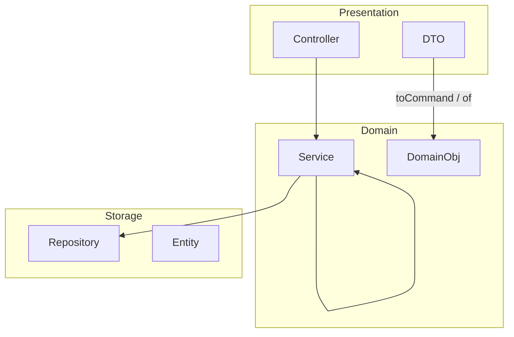
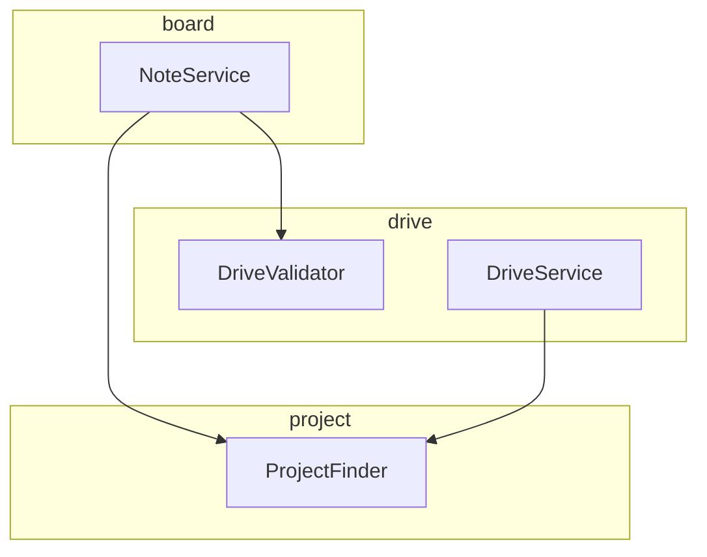
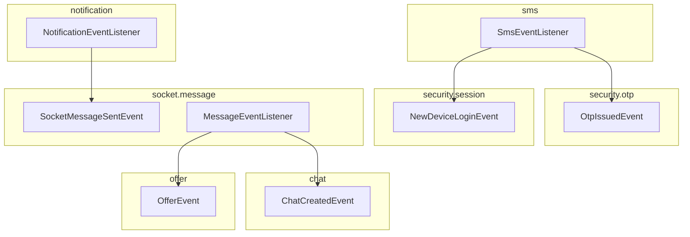

# 프로젝트 구조
- 위치 : 전체
- 범위 : 도메인, 레이어, 의존성

## 디렉터리 구조

```
to.bconnect.api
├── attachment              # 첨부 모듈
├── common                  # 공통 모듈
├── core                    # 비즈니스 코어
│   ├── presentation        # Presentation 레이어
│   └── domain              # Domain 레이어
├── notification            # 알림 모듈
├── storage                 # Storage 레이어
├── security                # 인증 · 인가
├── sms                     # SMS 모듈
└── socket                  # 실시간 통신 (STOMP)
```
- 레이어드 아키텍처(layer-first) 구조를 따릅니다.
- 패키지 · 레이어 의존성 규칙은 ArchUnit로 강제합니다.

## 패키지 구조
> notification → socket → core → attachment → security → storage → common
> sms → security
- `PackageDependencyTest.java` 참고

## 레이어 구조


| 레이어         | 패키지          | 행위 클래스     | 데이터 객체                | 변환 책임    | 도메인 교차                             |
|-------------|--------------|------------|-----------------------|----------|------------------------------------|
| Presentation | `presentation` | Controller | DTO                   | DTO      | 허용 (Controller → Service)          |
| Domain      | `domain`    | Service    | Domain · Command · Event | Service  | 허용 (Service → Service, Repository) |
| Storage     | `storage`   | Repository | Entity                |          | 비허용                                |

- `LayerDependencyTest.java` 참고

### 레이어 컨벤션
- 컨트롤러는 도메인 객체를 조회하고, 응답 DTO를 조립합니다.
- 응답 DTO의 `of` 메서드는 도메인 객체만 주입받고, DTO 변환은 내부에서 처리합니다.
- 비즈니스 로직은 서비스에서 처리합니다.
- 비즈니스 로직이 복잡한 경우 하위 컴포넌트를 생성해 로직을 분리할 수 있습니다.
- 엔티티 저장 구조는 Storage 레이어에 캡슐화합니다. (e.g. minId, maxId)
- 엔티티 제약 관리를 위해 `schema.sql` 파일을 별도로 관리합니다.
- 도메인 교차는 하향식만 허용됩니다.
- 도메인 교차 로직의 위치는 도메인 간 응집도를 고려해서 선정해야 합니다.

### 도메인 정책
- 탈퇴 회원 : 탈퇴 시 연관 데이터는 정리하되(`MemberCleaner`) DirectChat · GroupChat(participant) · 메시지는 유지한다. 채팅 조회 응답에서 탈퇴 회원은 제외하지 않고 `Member.WITHDRAWN` 상수로 표현하며, 전 필드가 `null`인 member 객체로 응답한다. 소유한 업체가 있으면 탈퇴할 수 없다(M003).

### 서비스 도메인 교차

- `DomainDependencyTest.java` 참고

### 이벤트 교차 (EDA)

- 부수효과는 EDA 구조로 분리합니다.
- 이벤트는 발행 패키지에, 리스너는 구독 패키지에 위치합니다.

### 유효성 검사
- 유효성 검사 위치는 다음과 같습니다
  - 자바 빈 유효성 : Request DTO 필드 어노테이션
  - 비즈니스 유효성 : Request DTO의 toCommand 메서드
  - DB 제약 : `schema.sql`

## 래퍼런스
- [Spring Framework : Java Bean Validation](https://docs.spring.io/spring-framework/reference/core/validation/beanvalidation.html)
- [Spring Framework : Standard and Custom Events](https://docs.spring.io/spring-framework/reference/core/beans/context-introduction.html#context-functionality-events)
- [Spring Framework : Transaction-bound Events](https://docs.spring.io/spring-framework/reference/data-access/transaction/event.html)