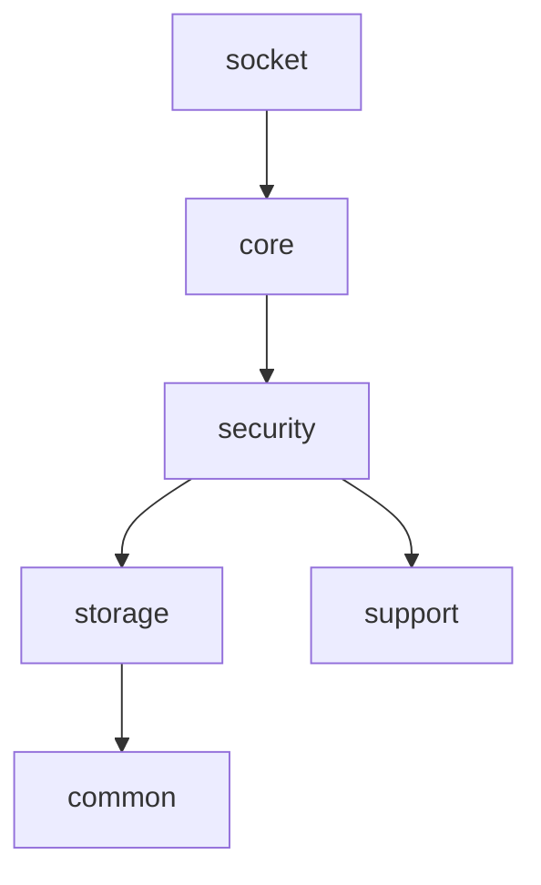
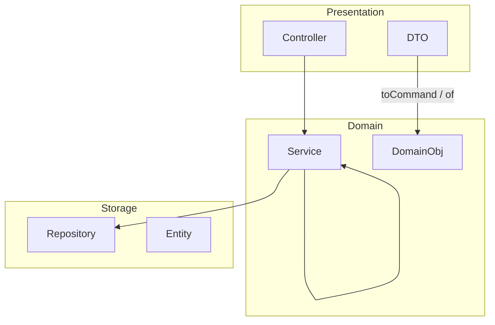
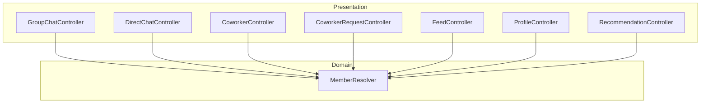
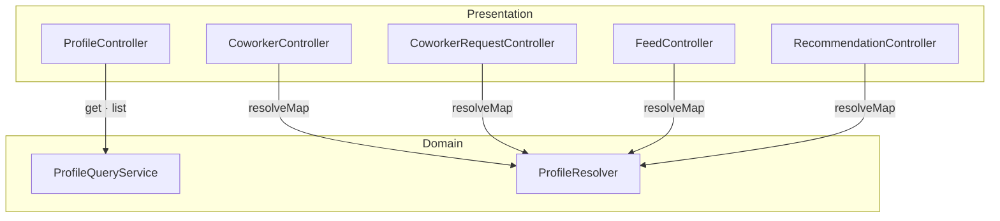
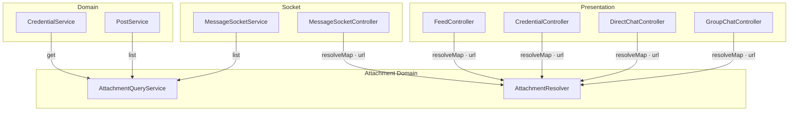
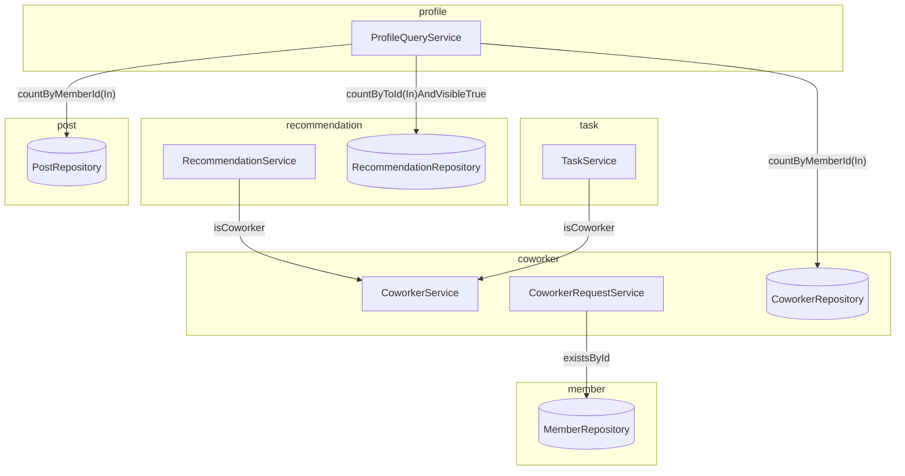

# 프로젝트 구조
- 위치 : 전체
- 범위 : 도메인, 레이어, 의존성

## 패키지 구조

```
to.bconnect.api
├── common                  # 공통 모듈
├── core                    # 비즈니스 코어
│   ├── presentation     # Presentation 레이어
│   └── domain              # Domain 레이어
│       ├── attachment
│       ├── chat
│       └── ...
├── storage                 # Storage 레이어
│   ├── attachment
│   ├── chat
│   └── ...
├── security                # 인증 · 인가
│   └── member
├── support                 # 제3자 서비스
└── socket                  # 실시간 통신 (STOMP)
```
- 레이어드 아키텍처(layer-first) 구조를 따릅니다.
- 패키지 · 레이어 의존성 규칙은 ArchUnit로 강제합니다.


- `PackageDependencyTest.java` 참고

## 레이어 구조



| 레이어         | 패키지          | 행위 클래스     | 데이터 객체 | 변환 책임    | 도메인 교차                             |
|-------------|--------------|------------|--------|----------|------------------------------------|
| Presentation | `presentation` | Controller | DTO | DTO      | 허용 (Controller → Service)          |
| Domain      | `domain`    | Service    | Domain | Service  | 허용 (Service → Service, Repository) |
| Storage     | `storage`   | Repository | Entity |          | 비허용                                |

- `LayerDependencyTest.java` 참고

### 컨벤션
- 비즈니스 로직은 서비스 클래스에서 처리합니다.
  - 하향식 도메인 교차는 모두 허용되며, 응집도에 따른 의존성을 고려해야 합니다.
  - 비즈니스 로직이 복잡한 경우 하위 컴포넌트를 생성해 관심사를 분리할 수 있습니다. (e.g. Finder, Validator, etc)
- 메서드명은 **비즈니스 관점**에서 작성합니다. (e.g. listLatestAccepted x, listPublic o)
- 유효성 검사 위치
  - Java Bean Validation : DTO 필드
  - 비즈니스 로직 : DTO → Command 변환
  - DB 무효성 : Entity 필드

## 도메인 의존성

- 공용 도메인 : Member, Profile, Attachment
- 도메인 교차 : Domain 계층 내에서 하방식 도메인 교차를 허용

### Member



### Profile


### Attachment



### 도메인 교차
공용 도메인을 제외한 도메인 간 교차


- MemberService.register → OtpService.verifyToken
- GroupChatService.create → Member.SYSTEM_ID

## 래퍼런스
- [Java Bean Validation](https://docs.spring.io/spring-framework/reference/core/validation/beanvalidation.html)