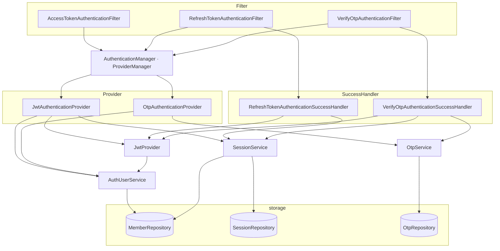
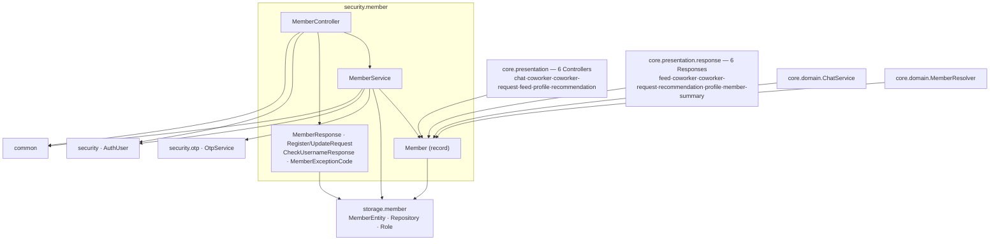

# security-architecture

## 범위
- 인증(Authentication)
- 인가(Authorization)
- OTP
- 세션(Session)
- 회원(AuthUser)

## Spring Security
- SecurityFilterChain : 보안 필터 체인
- AuthenticationFilter : 인증 요청을 Manager에 위임, 인증 후 처리를 SuccessHandler에 위임 (Presentation 계층)
- AuthenticationProvider : 실제 인증 로직
- AuthenticationManager / ProviderManager : Provider 관리 · 진입점
- Authentication : 인증 요청·결과를 담는 데이터 객체
- SecurityContextHolder / SecurityContext : 인증된 데이터 객체를 보관 (스레드 로컬)
- UserDetailsService / UserDetails : 회원 정보를 담는 데이터 객체
- GrantedAuthority : 권한 표현 (`ROLE_` 접두사)
- AuthenticationSuccessHandler : 인증 성공 후처리

### 래퍼런스
- [Spring Security : Architecture](https://docs.spring.io/spring-security/reference/servlet/architecture.html)
- [Spring Security : Authentication](https://docs.spring.io/spring-security/reference/servlet/authentication/architecture.html)

## 클래스 구조

### 공통
- AuthUser (UserDetails) : 인증 주체
- AuthUserService (UserDetailsService) : AuthUser

### jwt
- JwtProvider : JWT 생성 · 검증
- JwtAuthenticationProvider (AuthenticationProvider) : JWT 인증 처리
- JwtAuthenticationToken (AbstractAuthenticationToken) : JWT 인증 토큰
- AccessTokenAuthenticationFilter (OncePerRequestFilter) : access token 인증 처리
- RefreshTokenAuthenticationFilter (OncePerRequestFilter) : refresh token 처리
- RefreshTokenAuthenticationSuccessHandler (AuthenticationSuccessHandler) : access/refresh token 재발급

### otp
- OtpService : 인증코드 발송 · 검증
- OtpAuthenticationProvider (AuthenticationProvider) : OTP 검증
- OtpAuthenticationToken (AbstractAuthenticationToken) : OTP 인증 토큰
- VerifyOtpAuthenticationFilter (AbstractAuthenticationProcessingFilter) : OTP 검증 처리
- VerifyOtpAuthenticationSuccessHandler (AuthenticationSuccessHandler) : access/refresh or signup token 발급

### session
- SessionService : 세션 처리 (다른 기기에서 로그인 등)

## 인증 의존성

인증 파이프라인(Filter → Manager → Provider → 서비스 → Repository) 의존(import 전수 확인).

- `SessionService`는 신규 기기 로그인 시 `support.sms`(SmsProvider)도 사용.

## member 의존성

`security.member` 패키지 내·외부 의존(presentation·domain·패키지 내부 import 전수 확인 기준).

- **incoming은 전부 `Member`(record)에 집중** — `Member`가 core 전반(컨트롤러 6 · 응답 6 · ChatService)의 회원 표현으로 쓰이는 cross-cutting 개념인데 `security` 모듈에 위치. core는 주로 `MemberResolver`(core.domain)를 통해 접근.
- **outgoing**: `storage.member`(영속·Role), `security.otp`(가입 시 OTP 토큰 검증), `security.AuthUser`, `common`.
- ArchUnit 규칙(core → security, security → storage/security/common) 위반 없음. 다만 `Member`를 별도 도메인으로 본다면 위치 재고 여지(규칙 위반은 아님).

## Scope
- `security` module
