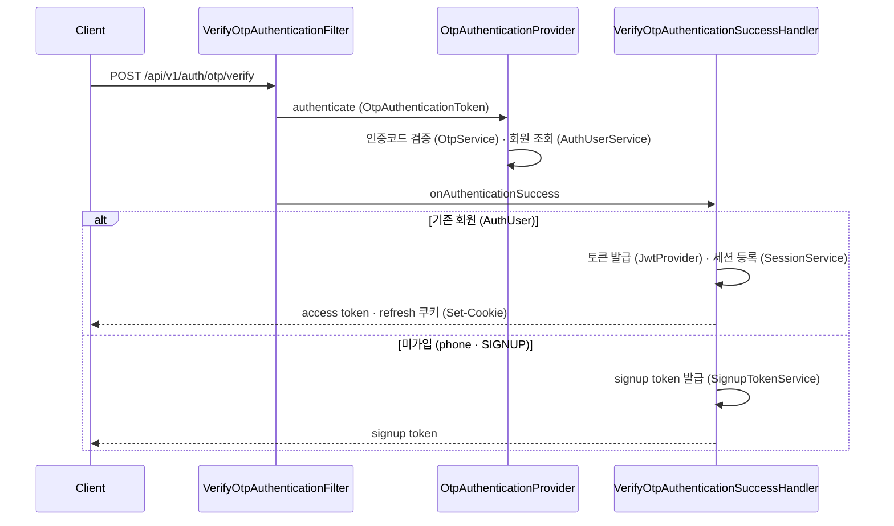
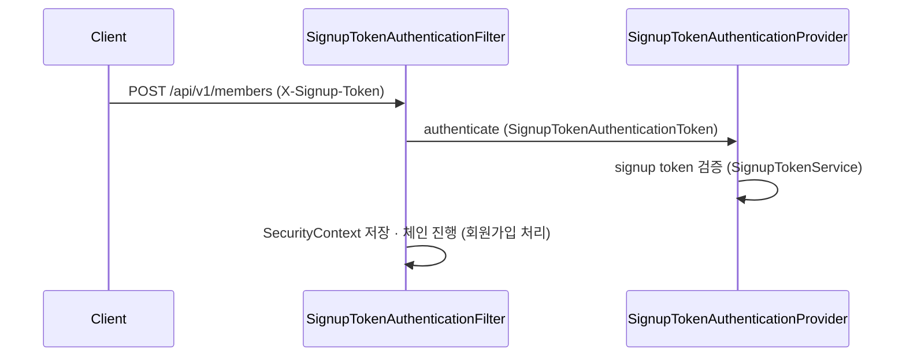
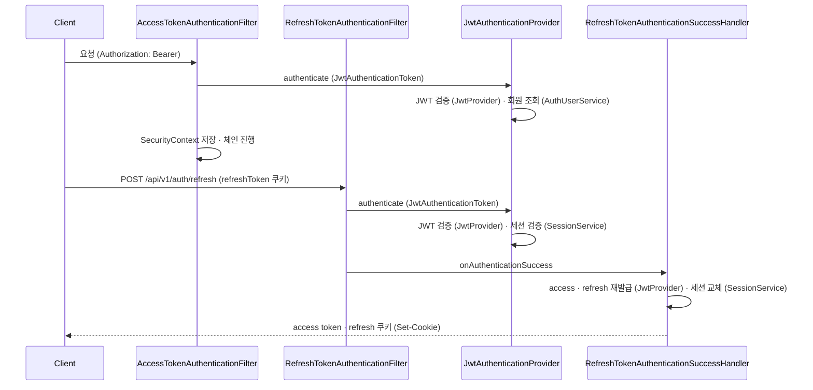

# security-architecture
- 위치 : `/security`
- 범위 : 인증 주체(AuthUser), JWT, OTP, 가입 토큰(SignupToken), 세션(Session)

## Spring Security 아키텍처
- SecurityFilterChain : 보안 필터 체인
- AuthenticationFilter : 인증 요청을 Manager에 위임, 인증 후 처리를 SuccessHandler에 위임 (Presentation 계층)
- AuthenticationProvider : 실제 인증 로직
- AuthenticationManager / ProviderManager : Provider 관리 · 진입점
- Authentication : 인증 요청·결과를 담는 데이터 객체
- SecurityContextHolder / SecurityContext : 인증된 데이터 객체를 보관 (스레드 로컬)
- UserDetailsService / UserDetails : 회원 정보를 담는 데이터 객체
- GrantedAuthority : 권한 표현 (`ROLE_` 접두사)
- AuthenticationSuccessHandler : 인증 성공 후처리
- AuthenticationFailureHandler : 인증 실패 후처리
- AuthenticationEntryPoint : 인가 단계 미인증 처리
- AccessDeniedHandler : 권한부족 처리

## 패키지 구성

- otp : 본인인증 (인증코드 발송 · 검증)
- signup : 회원가입 (가입 토큰)
- jwt : 인증 · 인가 처리 (access · refresh token)
- session : 세션 관리 (로그인 정보)

### otp

### signup

### jwt

## 래퍼런스
- [Spring Security : Architecture](https://docs.spring.io/spring-security/reference/servlet/architecture.html)
- [Spring Security : Authentication](https://docs.spring.io/spring-security/reference/servlet/authentication/architecture.html)