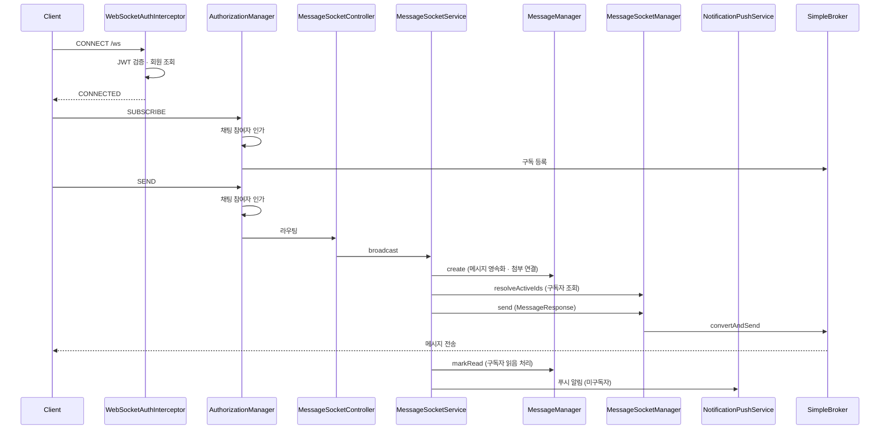

# stomp-architecture
- 위치 : `/socket`
- 범위 : 채팅(Chat), 메시지(Message)

## 메시지 송수신 흐름

## 컴포넌트 구성
- WebSocketConfig : WebSocket 설정
- WebSocketAuthInterceptor : STOMP 연결시 인증 처리
- WebSocketSecurityConfig : WebSocket 보안 설정
- WebSocketAuthorizationConfig : 인가 규칙 등록
  - GroupChatAuthorizationManager : 그룹 채팅방 인가 처리
  - DirectChatAuthorizationManager : 1:1 채팅방 인가 처리
- ChatReadInterceptor : SUBSCRIBE 프레임 감지 · 최신 메시지 읽음 처리
- MessageSocketController : 실시간 송신 STOMP 엔드포인트 (group · direct)
- MessageSocketService : 메시지 퍼사드 서비스
- MessageSocketManager : 실시간 메시지 전송 · 구독자 조회
- MessageManager : 메시지 영속화 · 읽음 처리
- MessageEventListener : 서버 이벤트를 SYSTEM · OFFER 메시지로 변환 후 송신
- MessageFinder : 메시지 목록 · 미읽음 카운트 조회 (`/core/domain/chat`)

## 메시지 규격

| 발신 경로 | 유형 | 내용 | 미리보기 |
|---|---|---|---|
| SendMessageRequest | TEXT · IMAGE · FILE | 사용자 입력 | 동일 |
| OfferEvent ACTIVE | OFFER | offerId | `MessageTemplate.OFFER_RECEIVED` |
| OfferEvent ACCEPTED | SYSTEM | `MessageTemplate.OFFER_ACCEPTED` | 동일 |
| OfferEvent EXPIRED | SYSTEM | `MessageTemplate.OFFER_EXPIRED` | 동일 |
| TaskEvent | SYSTEM | `MessageTemplate.TASK_UPDATED` | 동일 |
| ChatCreatedEvent | SYSTEM | `MessageTemplate.CHAT_CREATED` | 동일 |

- `content` 는 브로드캐스트 · 영속화 값이고 `preview` 는 미구독 참여자 푸시알림 본문이다.
- SYSTEM · OFFER 는 서버 이벤트 전용이며 `SendMessageRequest.toCommand` 에서 거부한다.

## 래퍼런스
- [Spring WebSocket : STOMP](https://docs.spring.io/spring-framework/reference/web/websocket/stomp.html)
