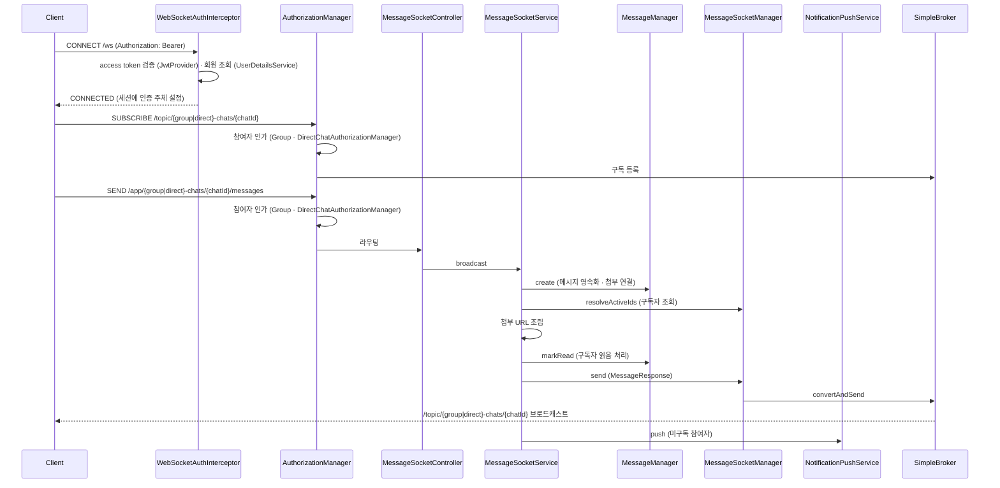

# stomp-architecture
- 위치 : `/socket`
- 범위 : 채팅(Chat), 메시지(Message)

## 메시지 송수신 흐름

## 컴포넌트 구성
- WebSocketConfig : WebSocket 설정
- WebSocketAuthInterceptor : STOMP 연결시 인증 처리
- WebSocketSecurityConfig : WebSocket 보안 설정
- WebSocketAuthorizationConfig : 인가 규칙 등록
  - GroupChatAuthorizationManager : 그룹 채팅방 인가 처리
  - DirectChatAuthorizationManager : 1:1 채팅방 인가 처리
- MessageSocketController : 실시간 송신 STOMP 엔드포인트 (group · direct)
- MessageSocketService : 메시지 퍼사드 서비스
- MessageSocketManager : 실시간 메시지 전송 · 구독자 조회
- MessageManager : 메시지 영속화 · 읽음 처리
- MessageFinder : 메시지 목록 · 미읽음 카운트 조회

## 래퍼런스
- [Spring WebSocket : STOMP](https://docs.spring.io/spring-framework/reference/web/websocket/stomp.html)
