# 보편언어 (Ubiquitous Language)
- 위치 : 전체
- 범위 : 도메인 용어, Enum 값

## 도메인 다이어그램

```mermaid
graph TD
    subgraph Chat
        DirectChat
        GroupChat
        Participant
        Message
        Participant -->|N:1| GroupChat
        Message -.->|N:1| DirectChat
        Message -.->|N:1| GroupChat
    end
    subgraph Social
        CoworkerRequest
        Coworker
        Recommendation
        CoworkerRequest -.->|수락| Coworker
        Coworker -.->|작성| Recommendation
    end
    subgraph Task
        Company
        Project
        ProjectTask
        Offer
        Project -->|N:1| Company
        ProjectTask -->|N:1| Project
        Offer -->|N:1| ProjectTask
    end
    subgraph Post
        WorkerTask
        post[Post]
        post -.->|N:1| WorkerTask
    end
    subgraph Profile
        profile[Profile]
        Credential
    end
    subgraph Security
        Member
        Otp
        Session
        Otp -.->|인증| Member
        Member -.->|로그인| Session
    end
    subgraph Drive
        drive[Drive]
        DriveMember
        DriveMember -->|N:1| drive
    end
    subgraph Board
        board[Board]
        Note
        Note -.->|N:1| board
    end
```

## 도메인 개념

| 도메인           | 영문             | 국문      | 의미                     |
|---------------|----------------|---------|------------------------|
| Member        | Member         | 회원      | 사용자                    |
| Auth          | Otp            | 인증코드    | 본인확인용 6자리 코드           |
| Auth          | SignupToken    | 가입 토큰   | 미가입자 회원가입용 임시 토큰       |
| Auth          | Session        | 세션      | 로그인 정보(IP, Agent 등)    |
| Auth          | Access Token   | 액세스 토큰  |                        |
| Auth          | Refresh Token  | 리프레시 토큰 | 액세스 토큰 재발급용 토큰         |
| Profile       | Profile        | 프로필     | 사용자 프로필                |
| Task          | Task           | 작업      | 프로젝트 공종별 작업 단위         |
| Post          | Post           | 게시글     |                        |
| Post          | Feed           | 피드      | 게시글 + 작성자 + 프로필 View   |
| Coworker      | Coworker       | 동료      | 동료 기술자                 |
| Coworker      | CoworkerRequest | 동료 요청   |                        |
| Recommendation | Recommendation | 추천서     | 동료 기술자가 작성한 추천서        |
| Chat          | GroupChat      | 그룹 채팅방  | 채팅방 제목 있음              |
| Chat          | DirectChat     | 1:1 채팅방 | 채팅방 제목 없음              |
| Chat          | Message        | 메시지     |                        |
| Chat          | Participant    | 참여자     | 그룹 채팅방 참여자 정보          |
| Credential    | Credential     | 인증뱃지    | 면허 · 자격 · 보험 등         |
| Attachment    | Attachment     | 첨부      | 업로드 파일 메타데이터           |
| Attachment    | Signed cookie  |         | CloudFront 접근 권한       |
| Company       | Company        | 인테리어 업체 |                        |
| Project       | Project        | 프로젝트    |                        |
| Offer         | Offer          | 제안      | 기술자 제안                 |
| Drive         | Drive          | 공유 저장소  | 원격 파일 · 이미지 저장소        |
| Drive         | DriveMember    | 저장소 멤버  | 저장소 접근 권한              |
| Board         | Board          | 게시판     | 프로젝트 · 저장소별 게시판 (자동 생성) |
| Board         | Note           | 노트      | 게시판에 작성된 글             |

## 열거형 (Enum)

### 회원 역할(Role)

| 유형 | 설명     |
|---|--------|
| GUEST | 게스트    |
| USER | 사용자    |
| ADMIN | 어드민    |

### 프로필 역할(ProfileRole)

| 유형 | 설명     |
|---|--------|
| CONTRACTOR | 인테리어 업체 |
| CLIENT | 소비자    |
| ARCHITECT | 건축가    |
| FOREMAN | 반장     |
| SKILLED | 기공     |
| SEMI_SKILLED | 준기공    |
| HELPER | 조공     |

### 공종(TRADE)

| 공정 구분 | 유형 | 설명 |
|---|---|---|
| 기반 공정 | DESIGN | 설계 |
| 기반 공정 | DEMOLITION | 철거/확장 |
| 기반 공정 | ELECTRICAL | 전기 |
| 기반 공정 | PLUMBING | 배관 |
| 기반 공정 | MECHANICAL | 설비 |
| 구조 공정 | MASONRY | 조적 |
| 구조 공정 | CARPENTRY | 목공 |
| 구조 공정 | GLAZING | 창호 |
| 구조 공정 | WATERPROOFING | 방수 |
| 구조 공정 | PLASTERING | 미장 |
| 구조 공정 | INSULATION | 단열 |
| 마감 공정 | TILING | 타일 |
| 마감 공정 | GROUTING | 줄눈 |
| 마감 공정 | PAINTING | 도장 |
| 마감 공정 | WALLPAPER | 도배 |
| 마감 공정 | FILM_SHEET | 필름/시트 |
| 마감 공정 | HARDWOOD | 마루 |
| 마감 공정 | VINYL | 장판 |
| 설치 | SINK | 싱크대 |
| 설치 | FURNITURE | 가구 |
| 설치 | AIR_CONDITIONING | 에어컨 |
| 현장지원 | HOISTING | 양중/곰방 |
| 현장지원 | TRANSPORT | 운송 |
| 현장지원 | CLEANING | 청소 |
| 현장지원 | GENERAL_LABOR | 보통인부 |

### 작업 유형(TaskType)

| 유형 | 설명 |
|---|---|
| WORKER | 기술자 작업 |
| PROJECT | 프로젝트 작업 |

### 작업 상태(TaskStatus)

| 유형 | 프로젝트(업체) | 기술자 |
|---|---|---|
| DRAFT | 시작 전 | 시작 전 |
| OPEN | 모집 중 | 지원 완료 |
| OFFERED | 섭외 중 | 제안 받음 |
| SCHEDULED | 섭외 됨 | 시공 전 |
| IN_PROGRESS | 진행 중 | 진행 중 |
| COMPLETED | 시공 완료 | 시공 완료 |

### 동료(Coworker)

| 유형 | 설명 |
|---|---|
| NONE | 관계없음 |
| SENT | 보낸 요청 |
| RECEIVED | 받은 요청 |
| COWORKER | 동료 |

### 채팅방 유형(ChatType)

| 유형 | 설명 |
|---|---|
| GROUP | 그룹 채팅방 |
| DIRECT | 1:1 채팅방 |

### 메시지 유형(MessageType)

| 유형     | 설명 |
|--------|----|
| TEXT   | 텍스트 |
| IMAGE  | 이미지 |
| FILE   | 파일 |
| SYSTEM | 시스템 |
| OFFER  | 제안 |

### 인증뱃지 유형(CredentialType)

| 유형 | 설명 |
|---|---|
| IDENTITY_VERIFICATION | 본인인증 |
| SOLE_PROPRIETOR | 개인사업자 |
| CONSTRUCTION_LICENSE | 건설업면허 |
| SPECIALTY_CONSTRUCTION_LICENSE | 전문건설업면허 |
| CAREER_CERTIFICATE | 경력증명서 |
| SKILL_GRADE_CERTIFICATE | 기능등급증명서 |
| OTHER_CERTIFICATE | 기타 증명서 |
| NATIONAL_TECHNICAL_QUALIFICATION | 국가기술자격 |
| SKILLED_TECHNICIAN | 숙련기술인 |
| OTHER_QUALIFICATION | 기타 자격증 |

### 저장소 유형(DriveType)

| 유형     | 설명          |
|--------|-------------|
| PROJECT | 프로젝트 소유 저장소 |
| MEMBER | 사용자 소유 저장소     |

### 게시판 유형(BoardType)

| 유형     | 설명      |
|--------|---------|
| PROJECT | 프로젝트 게시판 |
| DRIVE  | 저장소 게시판 |
