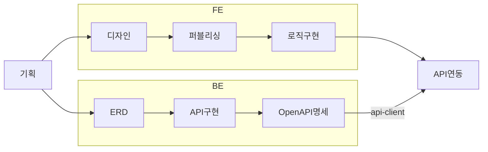

# 개발 프로세스

> 대상: 모든 개발자<br>
> 학습 목표: 전체 워크플로우를 이해하고, Git을 활용해 워크플로우를 수행할 수 있다.

## 전체 플로우

기획을 시작점으로 FE · BE 작업이 병렬 진행되고, OpenAPI 명세에서 합류합니다.



프론트엔드 개발시 필요한 API가 명세에 존재하지 않는 경우 백엔드 측에 구현을 요구하는 이슈를 생성합니다. 이 경우 MSW mock을 활용해 미리 개발할 수 있습니다.

## Git 워크 플로우

1. 깃허브 이슈 생성
2. 이슈 브랜치 생성
3. 작업 · 커밋 진행
4. PR 생성
5. CI 성공 · PR 머지

### 커밋 컨벤션

[Conventional Commits](https://www.conventionalcommits.org)을 준수합니다.

```bash
<type>[optional scope]: <description> [optional issue]
```

- 범위를 명시합니다 (예: career, plan, api 등)
- 필요한 경우 커밋 메시지 끝에 이슈 번호를 추가할 수 있습니다.

### 브랜치 전략

[Git-flow](https://nvie.com/posts/a-successful-git-branching-model) 전략을 따릅니다.

- `main` : 제품 출시 버전을 관리하는 브랜치
- `dev` : 다음 출시 버전을 위해 개발하는 브랜치 (메인)
- `#XXX-<desc>` : 이슈 해결을 위해 개발하는 브랜치
- `hotfix` : 출시된 제품의 버그를 고치기 위한 브랜치

## 참조

- [ISSUE_TEMPLATE](../../.github/ISSUE_TEMPLATE/) 참고
- [PR 템플릿](../../.github/pull_request_template.md) 참고
- 로컬 개발서버 실행 참고 [README.md](../../README.md)
- 개발 환경 설정시 참고 [ONBOARDING.md](../tutorials/ONBOARDING.md)
- 환경변수 추가시 참고 [manage-variables.md](./manage-variables.md)
- OpenAPI 명세 기반 타입 · 훅 생성 관련 자료 [package-api-client.md](../reference/package-api-client.md)
